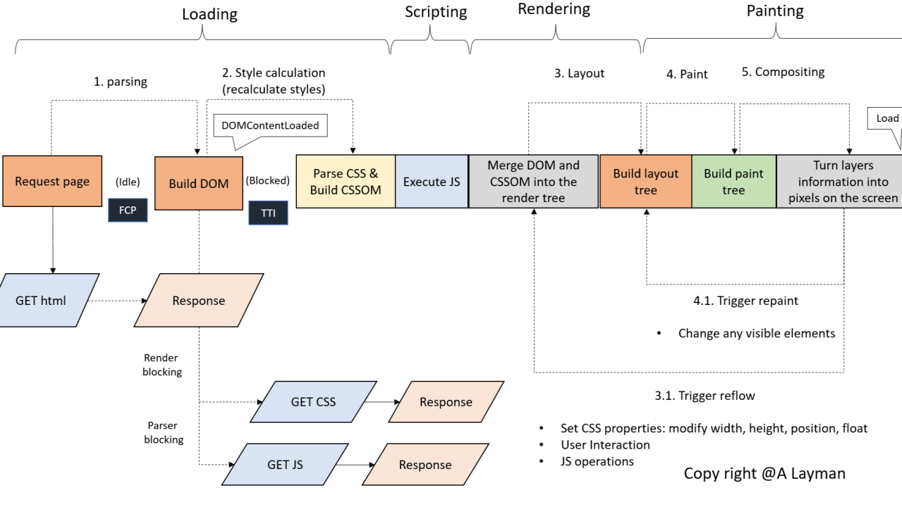
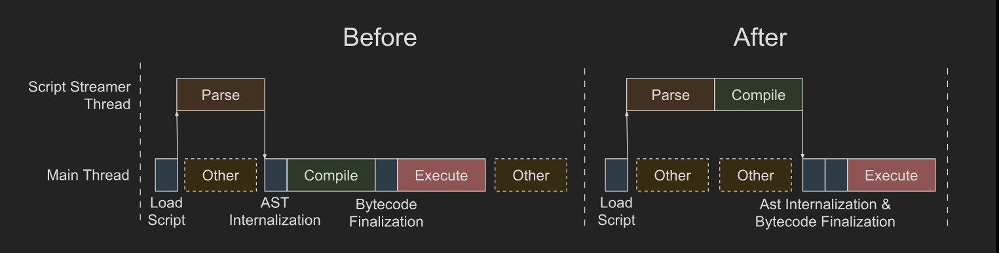
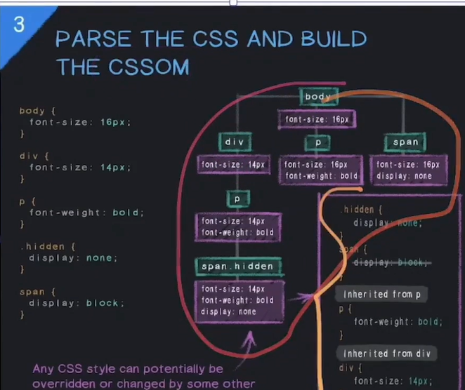
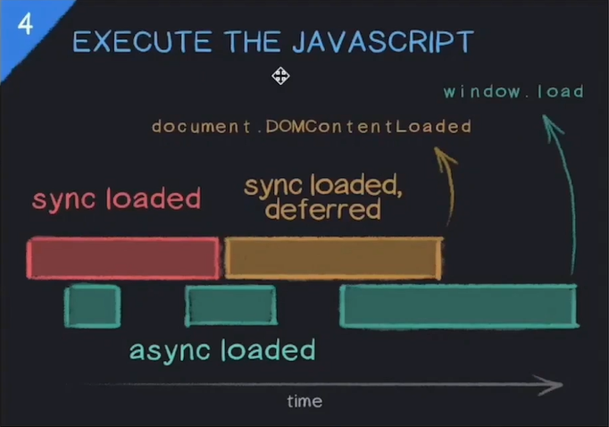
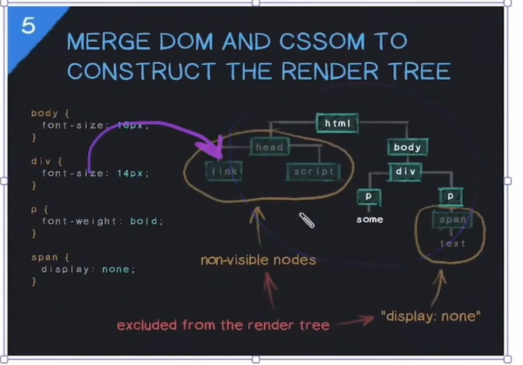
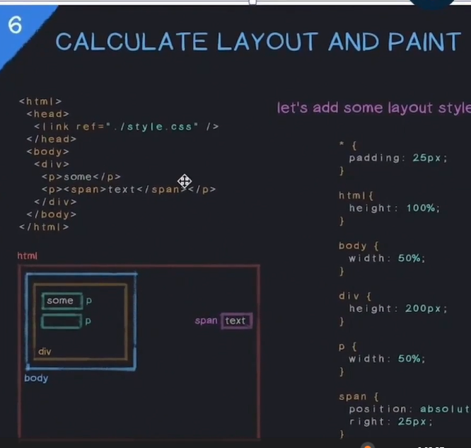

# 🌐 Browser Rendering Pipeline - From HTML to Pixels

This document explains the step-by-step journey a browser takes to convert HTML, CSS, and JavaScript into visible content on your screen. It follows the **Rendering Pipeline**, breaking it into stages with clear keywords.

---

## 🧭 Overview of Stages

### 🔹 1. Loading

#### ✅ Request Page
- Browser sends an HTTP request to fetch the web page (HTML).

#### ✅ GET HTML → Response
- HTML file is received from the server.

#### ✅ Build DOM (Document Object Model)
- HTML is parsed and transformed into a **DOM Tree**, representing the structure of the document.

#### 🔸 FCP (First Contentful Paint)
- Time when first content (like text/image) is rendered to screen.

---

### 🔹 2. Style Calculation

#### ✅ GET CSS → Response
- External stylesheets are downloaded.

#### ✅ Parse CSS & Build CSSOM (CSS Object Model)
- CSS is parsed into a structure similar to DOM, known as **CSSOM**.

#### 🔸 DOMContentLoaded
- Event fired when the DOM is completely built (no waiting for CSS/JS/images).

---

### 🔹 3. Scripting

#### ✅ Execute JS (JavaScript)
- JavaScript is parsed and executed. It can modify the DOM/CSSOM.

#### 🔸 TTI (Time To Interactive)
- Point when the page becomes fully interactive (JS loaded, main thread idle).

---

### 🔹 4. Rendering

#### ✅ Merge DOM and CSSOM into the Render Tree
- DOM + CSSOM = Render Tree → visual representation of content.

#### ✅ Build Layout Tree (Reflow)
- Calculates **positions and sizes** of elements on screen.

---

### 🔹 5. Painting

#### ✅ Build Paint Tree
- Decides **how** each element should be painted (colors, borders, shadows).

#### ✅ Turn Layers into Pixels (Compositing)
- Final step: **Layers** are drawn as pixels on screen.

#### 🔸 Load Event
- Fired when everything (HTML, CSS, JS, images, etc.) is fully loaded.

---

## 🎯 Key Performance Triggers

### 🔁 3.1 Trigger Reflow (Layout Changes)
- Any change in size, position, or layout of elements triggers **reflow**.

### 🎨 4.1 Trigger Repaint (Visual Changes)
- Style changes like `color`, `background`, `border` cause **repaint** without reflow.

---

## 🚧 Render Blocking Resources
- **CSS** is render-blocking: Page cannot render until CSS is parsed.
- **JS** can block DOM parsing if encountered during HTML parsing.

---

## 🔑 Important Terms

| Keyword              | Description |
|----------------------|-------------|
| DOM                  | Document Object Model (HTML structure) |
| CSSOM                | CSS Object Model (CSS structure) |
| Render Tree          | Visual representation (DOM + CSSOM) |
| FCP                  | First Contentful Paint |
| TTI                  | Time To Interactive |
| Layout Tree          | Structure with exact element dimensions |
| Paint Tree           | Visual details of elements |
| Compositing          | Convert layers to screen pixels |
| DOMContentLoaded     | Triggered when DOM is ready |
| Load                 | Triggered after all resources are loaded |

---

## 💡 Optimization Tips

- Minimize render-blocking CSS/JS.
- Use async/defer for scripts.
- Reduce DOM depth and CSS complexity.
- Avoid unnecessary reflows and repaints.

# JS :

---

> \"Understanding the browser's rendering pipeline is the first step to building blazing-fast websites.\"

---

Feel free to use this README for educational purposes, frontend interview prep, or web performance optimization projects!
