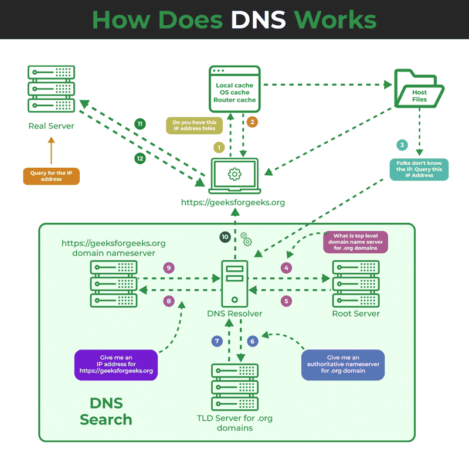
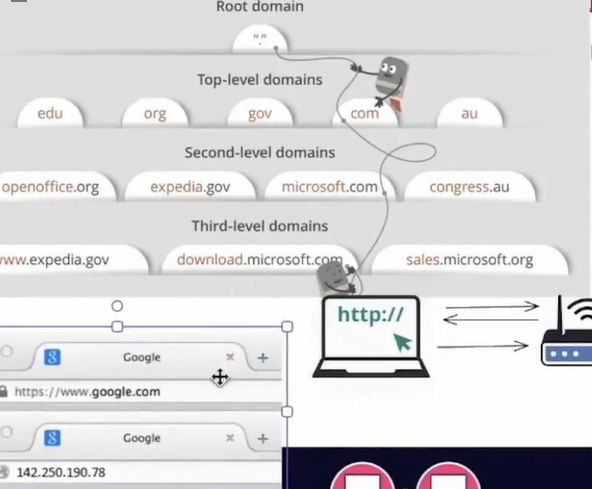
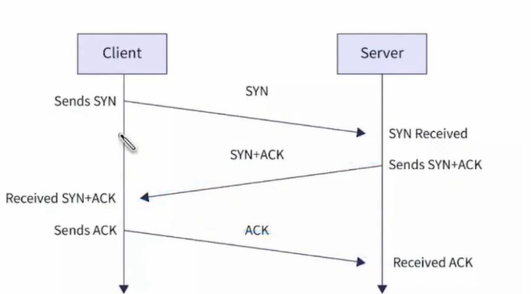
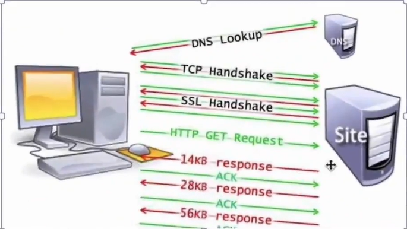

# How the Web Works
=====================

## Table of Contents
-----------------

* [Overview](#overview)
* [Client-Server Interaction](#client-server-interaction)
* [Key Components](#key-components)
* [Network Types](#network-types)
* [How it Works](#how-it-works)
* [Key Concepts](#key-concepts)
* [Additional Resources](#additional-resources)

## Overview
------------

The web is a complex system that enables communication between devices and servers. In this README, we'll break down the key components and concepts that make the web work.

## Client-Server Interaction
---------------------------

The web works on a **client-server model**, where:

* **Client**: A device (e.g., browser, mobile app) sends a request to access a resource.
* **Server**: A remote computer (e.g., web server) processes the request and returns the resource.

### IP Address
-------------

* **IP Address**: A unique string of numbers identifying a device on a network or internet, like a device's home address.

## Key Components
------------------

* **DNS (Domain Name System)**: Translates human-readable domain names to IP addresses.
* **HTTP (Hypertext Transfer Protocol)**: A protocol for transferring data over the web.
* **TCP/IP (Transmission Control Protocol/Internet Protocol)**: A suite of protocols governing internet communication.

## Network Types
----------------

* **LAN (Local Area Network)**: A network of devices in a limited geographic area (e.g., home, office).
* **WAN (Wide Area Network)**: A network of devices spanning a larger geographic area (e.g., city, country).

## How it Works
----------------

1. **Request**: Client sends an HTTP request to access a resource.
2. **DNS Resolution**: DNS translates the domain name to an IP address.
3. **Request Sent**: Client sends the request to the server's IP address.
4. **Server Processing**: Server processes the request and returns the resource.
5. **Response**: Server sends the response back to the client.

## Key Concepts
----------------

* **Packets**: Small chunks of data transmitted over the internet.
* **Protocols**: Rules governing communication between devices.

## Additional Resources
-----------------------

* [Learn more about HTTP](https://developer.mozilla.org/en-US/docs/Web/HTTP)
* [Learn more about DNS](https://www.cloudflare.com/learning/dns/what-is-dns/)
* [Learn more about TCP/IP](https://www.geeksforgeeks.org/tcp-ip-model/)

# IP Addresses and Networking Basics
=====================================

## IPv4
--------

* **Format**: Dotted decimal notation (e.g., 192.168.1.1)
* **Address length**: 32 bits (4 bytes)
* **Address space**: Approximately 4.3 billion unique addresses
* **Private IP ranges**:
	+ 10.0.0.0/8
	+ 172.16.0.0/12
	+ 192.168.0.0/16

## IPv6
--------

* **Format**: Hexadecimal notation (e.g., 2001:0db8:85a3:0000:0000:8a2e:0370:7334)
* **Address length**: 128 bits (16 bytes)
* **Address space**: Virtually unlimited unique addresses
* **Shortened format**: Omitting leading zeros and consecutive sections of zeros (e.g., 2001:db8:85a3::8a2e:370:7334)

# Service Worker
================

A Service Worker is a script that runs in the background of a web application, managing network requests, caching resources, and providing offline support.

## Key Features
----------------

* **Offline support**: Enable web apps to function offline or with a slow network connection.
* **Caching**: Cache resources to reduce network requests and improve performance.
* **Network request management**: Intercept and modify network requests.
* **Push notifications**: Receive push notifications and notify users of updates or events.

## Benefits
------------

* **Improved performance**: Reduce network requests and improve page load times.
* **Enhanced user experience**: Enable offline support, push notifications, and other features.
* **Increased reliability**: Handle network errors and provide a more reliable experience.

## Use Cases
-------------

* **Progressive Web Apps (PWAs)**: Service Workers are a key technology for building PWAs.
* **Offline-enabled web apps**: Enable web apps to function offline or with a slow network connection.
* **Caching and performance optimization**: Cache resources and optimize performance.

# Progressive Web Apps (PWAs)
=============================

Progressive Web Apps (PWAs) are web applications that provide a native app-like experience to users. They combine the best features of web and mobile apps.

## Key Characteristics
------------------------

* **Responsive**: PWAs work seamlessly on various devices and screen sizes.
* **Fast**: PWAs load quickly, even on slow networks.
* **Reliable**: PWAs function offline or with a slow network connection.
* **Engaging**: PWAs provide an immersive experience with features like push notifications and home screen installation.

## Benefits
------------

* **Cross-platform compatibility**: PWAs work on multiple platforms, including desktop, mobile, and tablet.
* **No app store required**: PWAs can be installed directly from the web.
* **Easy maintenance**: PWAs are easier to update and maintain than native apps.
* **Increased engagement**: PWAs provide features like push notifications, increasing user engagement.

## Features
------------

* **Service Workers**: Manage network requests, caching, and offline support.
* **Web App Manifest**: Define app metadata, icons, and installation settings.
* **Push notifications**: Send notifications to users, even when the app is not open.
* **Home screen installation**: Allow users to install PWAs on their home screen.

## Why Build PWAs?
------------------

* **Reach a wider audience**: PWAs can reach users on multiple platforms.
* **Improve user experience**: PWAs provide a fast, reliable, and engaging experience.
* **Increase conversions**: PWAs can increase conversions, such as sales or engagement.

## Basic Concepts
------------------

1. **Subnetting**: Dividing a network into smaller sub-networks for better management and security.
2. **CIDR (Classless Inter-Domain Routing)**: A notation for specifying IP address ranges (e.g., 192.168.1.0/24).
3. **Gateway**: A device that connects a local network to the internet or another network.
4. **NAT (Network Address Translation)**: Translating private IP addresses to public IP addresses for internet access.
5. **DHCP (Dynamic Host Configuration Protocol)**: Assigning IP addresses and other network settings to devices dynamically.
## ICANN
---------
* **ICANN, or the Internet Corporation for Assigned Names and Numbers, is a non-profit organization responsible for managing the global domain name system (DNS). Here's what ICANN does:**

**Domain Name Management:** ICANN oversees the allocation and assignment of domain names, ensuring each domain is unique and properly routed on the internet.
**Policy Development:** ICANN develops policies for the DNS, including rules for registering and managing domain names.
**Global Outreach:**ICANN engages in outreach activities worldwide, promoting awareness and understanding of DNS policies and procedures.

## Common Interview Questions
-----------------------------

1. **What is the difference between IPv4 and IPv6?**: IPv4 has a 32-bit address length, while IPv6 has a 128-bit address length, providing a much larger address space.
2. **How does subnetting work?**: Subnetting divides a network into smaller sub-networks by applying a subnet mask to an IP address.
3. **What is CIDR notation?**: CIDR notation specifies an IP address range using a prefix length (e.g., 192.168.1.0/24).
4. **How does NAT work?**: NAT translates private IP addresses to public IP addresses for internet access, allowing multiple devices to share a single public IP.
5. **What is the purpose of a gateway?**: A gateway connects a local network to the internet or another network, enabling communication between devices.
6. **How does DHCP work?**: DHCP assigns IP addresses and other network settings to devices dynamically, simplifying network configuration.
7. **What are the benefits of using IPv6 over IPv4?**: IPv6 provides a much larger address space, improved security, and better performance.
8. **How do you calculate the subnet mask for a given IP address?**: The subnet mask is calculated based on the prefix length in CIDR notation (e.g., /24 corresponds to a subnet mask of 255.255.255.0).